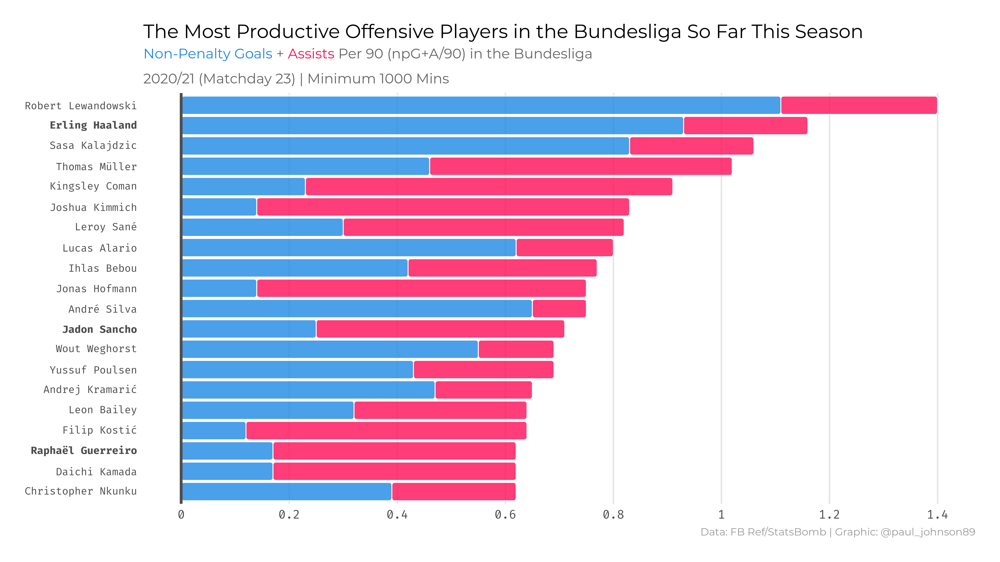
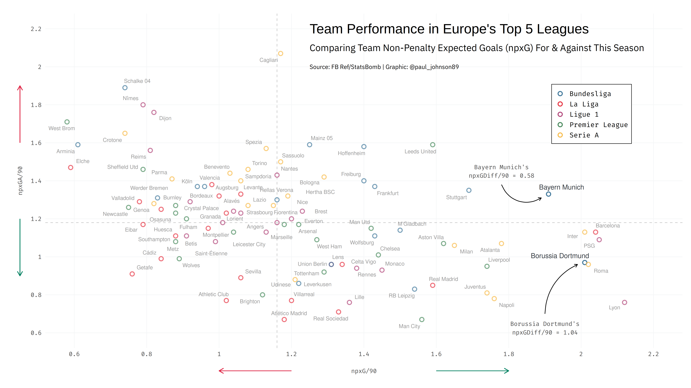
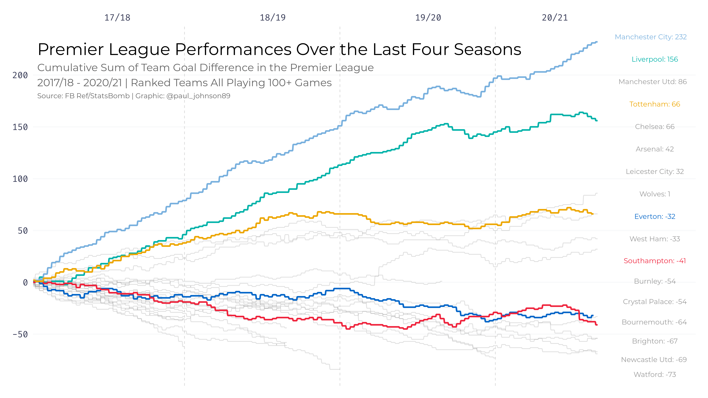
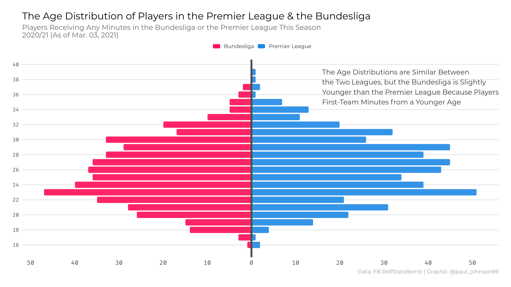

# Football Analytics

Repository containing the code for previous football analytics visualizations and articles.

As some of this is being done retroactively, the repository isn't exhaustive, and some of the code needs to be cleaned up. It is a work in progress, but many of the examples should be reproducible!

## Examples

### [Goalkeeper Analysis](goalkeeper-analysis)

- [Answering the Burki Question: Is BVB’s Goalkeeper Good Enough?](https://www.fearthewall.com/2021/2/9/22267317/roman-burki-borussia-bvb-goalkeeper-analysis-borussia-dortmund-bundesliga-bayern-munich-manuel-neuer)

### [Analyzing Jadon Sancho's Season So Far](sancho)

- [Twitter thread discussing Jadon Sancho's Performances in the Bundesliga](https://twitter.com/paul_johnson89/status/1367160195118477316)

### [BVB's xG Trends](bvb-xg)

- [Twitter thread discussing Borussia Dortmund's xG](https://twitter.com/paul_johnson89/status/1361021414447476736)

- [Twitter thread discussing team offensive performances across Europe's big five leagues](https://twitter.com/paul_johnson89/status/1346872980094263298?s=20)

### [Southampton's Struggles in the EPL](epl)

- [Twitter thread discussing Southampton's issues](https://twitter.com/paul_johnson89/status/1366144249096523776)

### [Age Distribution in European Football](age)

## License

All code contained in the repository is licensed under the [MIT license](LICENSE).

## Contact

If you have any questions or comments, feel free to contact [me](https://github.com/paulj1989) by [email](mailto:paul@paulrjohnson.net), or on [Twitter](https://twitter.com/paul_johnson89).
