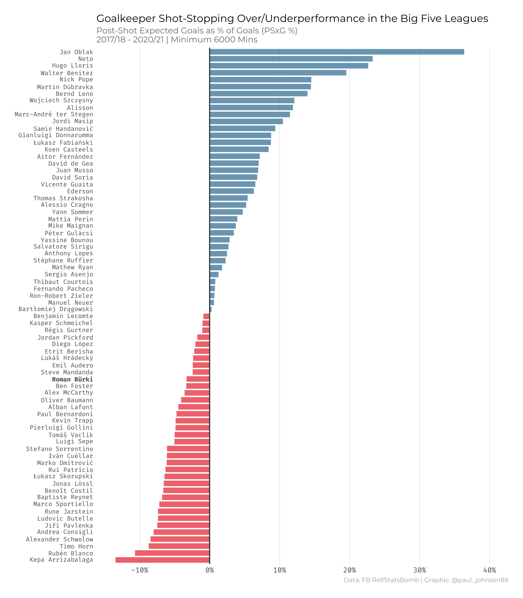
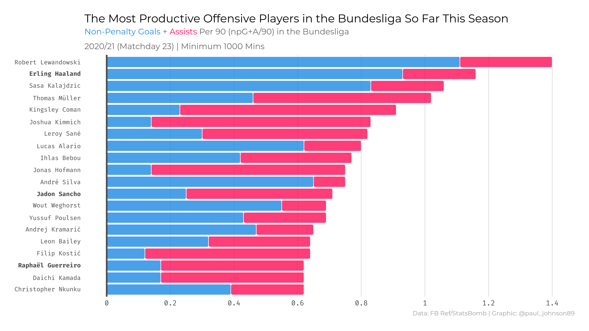
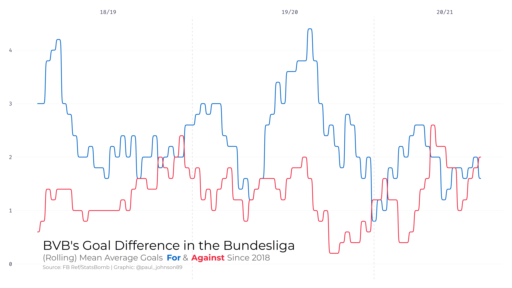
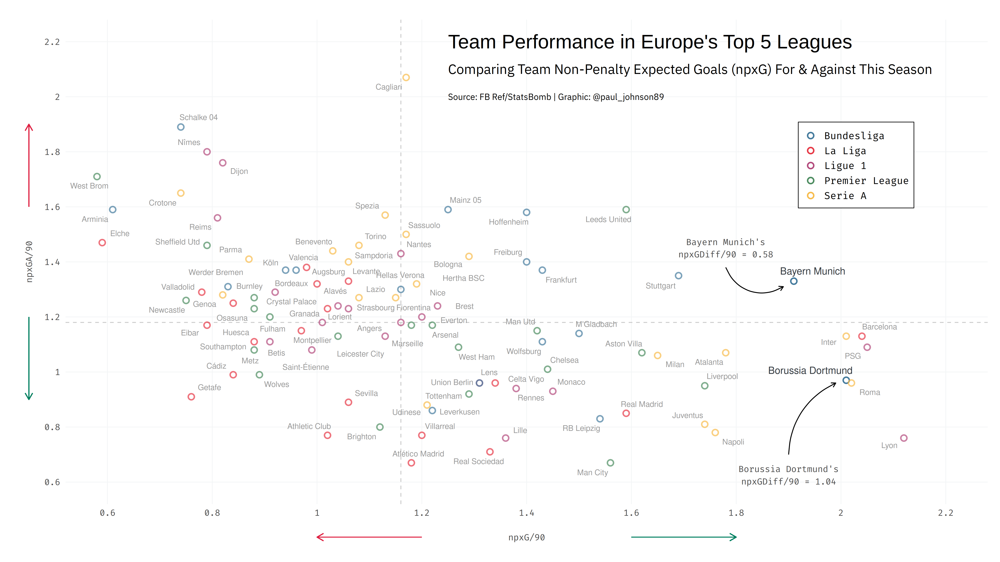
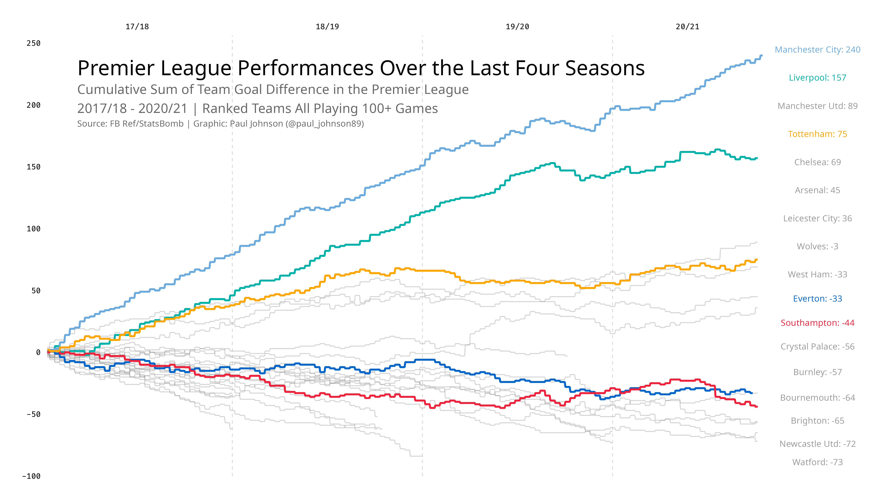
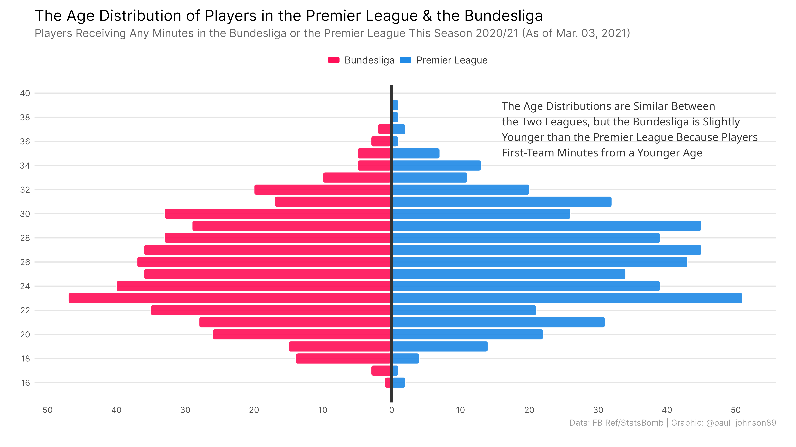

# Football Analytics

Repository containing the code for previous football analytics visualizations and articles. This repository will occasionally be updated with small analytics projects, typically for articles written for [Fear the Wall](https://fearthewall.com). Every now and then I will work on more in-depth football analytics projects, which will be contained in their own repositories, and linked to from here.

As some of this has been done retroactively, the repository isn't exhaustive, and some of the code could be done with being cleaned up (something I'll pretend that I will get to one day, but that will probably never happen). Nonetheless, many of the examples should be reproducible, and more recent examples should be cleaner, better organised, and better documented.

The archive folder contains pieces of work that are older and some of which has missing data or code. It's the rug I'm sweeping the worst of my code under, from before I was better at tracking what I'm doing...

## Ongoing Work

- [Money in Football](https://github.com/paulj1989/money-in-football)

- [Game State Analysis](https://github.com/paulj1989/game-state)

## Selected Work

### [Goalkeeper Analysis](bvb/goalkeeper-analysis)

- [Answering the Burki Question: Is BVB’s Goalkeeper Good Enough?](https://www.fearthewall.com/2021/2/9/22267317/roman-burki-borussia-bvb-goalkeeper-analysis-borussia-dortmund-bundesliga-bayern-munich-manuel-neuer)

### [Analyzing Jadon Sancho's Season So Far](bvb/sancho)

- [Twitter thread discussing Jadon Sancho's Performances in the Bundesliga](https://twitter.com/paul_johnson89/status/1367160195118477316)

### [BVB's xG Trends](bvb/xg)

- [Twitter thread discussing Borussia Dortmund's xG](https://twitter.com/paul_johnson89/status/1361021414447476736)

- [Twitter thread discussing team offensive performances across Europe's big five leagues](https://twitter.com/paul_johnson89/status/1346872980094263298?s=20)

### [Southampton's Struggles in the EPL](saints)

- [Twitter thread discussing Southampton's issues](https://twitter.com/paul_johnson89/status/1366144249096523776)

### [Age Distribution in European Football](age-distributions)

## License

All code contained in the repository is licensed under the [MIT license](LICENSE).

## Contact

If you have any questions or comments, feel free to contact me by [email](mailto:paul@paulrjohnson.net), or on [Twitter](https://twitter.com/paul_johnson89).
