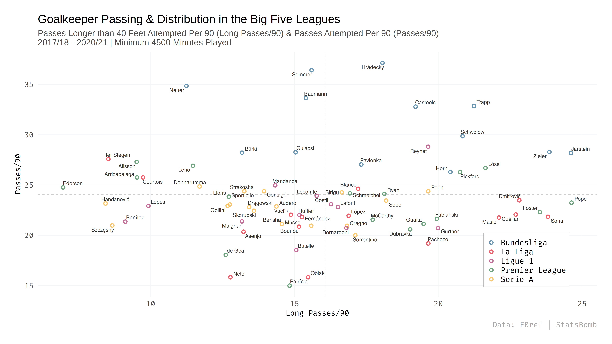

# Goalkeeper Analysis

I recently wrote a [four-part series analyzing Roman Burki's performances for Borussia Dortmund](https://www.fearthewall.com/2021/2/9/22267317/roman-burki-borussia-bvb-goalkeeper-analysis-borussia-dortmund-bundesliga-bayern-munich-manuel-neuer), and identifying potential replacements for BVB to target in the summer. The code for the visualizations in the analysis are here.

The gk_analysis.R script contains all the code for the visualizations in the first three articles in the series, and the replacements.R script contains everything for the final part of the series.

## Examples

### Post-Shot Expected Goals - PSxG %

### Distribution

